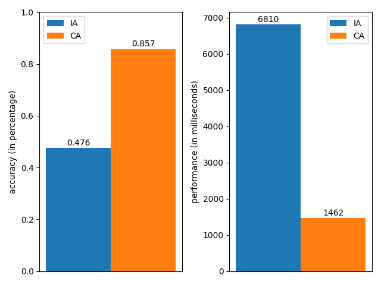

## Initial Evaluation of penda

This brief writing aims to provide insight into an initial evaluation of the internal workings of **penda**. It also
outlines some planned major next steps.

### Acknowledgements

We want to thank _ndricimrr_ for providing frequent and valuable feedback.

### Spelling Corrector

A spelling corrector, loosely described, is an algorithm that is tasked with providing relevant corrections to
misspellings in a given text. These errors can be typically classified in non-word errors (**NWE**) and real word
errors (**RWE**) [2]. If a word is valid under some context in the given language, then it is an **RWE**, otherwise it
is an **NWE**. Refer to [2] for additional details regarding this classification.

Throughout the development of **penda**, there have been two major rewrites of the central algorithm, at both times
addressing **NWE**s. Here we will benchmark their accuracy and performance. We compare one of the initial algorithms
(**IA**) we used, inspired by [4], and the current one (**CA**) inspired by [1]. A dataset custom-made for this
benchmarking purpose comprised of 3919 characters, **Kuturu** [3], is utilized here. Running them both on this dataset,
we note that **IA** takes about 6810 milliseconds, while **CA** takes about 1462 milliseconds, a substantial improvement
in time. **CA** again performs better as it scores a higher accuracy (roughly taking into account both false positive
and false negative **NWE**s) on the actual reported 42 typos, a score of 85.7%, while **IA** achieves a score of 47.6%.
The following figure visually displays these comparisons.

Fig. 1 Accuracy and performance bar charts of the both major rewrites.

Given the current behaviour, the undetected **NWE**s are rather trivial to solve, along with false positive **NWE**s.
Regarding **RWE**s, tackling them would require rewriting much of the behaviour, which we are very much looking forward
to. There is ongoing discussion on what we would be able to use for this topic, ranging from n-grams (perhaps tri-grams)
, to more advanced deep-learning based methods.

We want to emphasize that the results draw here ought not to be considered as a comprehensive evaluation of the
capabilities of **penda**, but rather as shallow/weak indicators.

### Loanwords

A curated list of loanwords with meaningful alternatives in the Albanian language has been created by _AndiBraimllari_
and _KostaTB_. It currently contains entries for a total of 30 words. Of these, 15 are of the ottoman origin, 2 from
slavic, 13 from english, 1 greek. **penda** attempts to provide a highlight with such information, including an
alternative. This aims to preserve and uphold the correct words and phrases in the Albanian language, as it already has
a rich vocabulary in itself. Regardless that it is one of seemingly the easiest features to implement, it still has
quite a few challenges, e.g. conjugation (and other modifications) of the loanwords as provided by a user.

### Closing Thoughts

It is evident that the current algorithmic capabilities of **penda** are limited and not yet ripe for production use.
They're primarily focused on correction of typos, with highlights on very few loanwords. Additionally, the UI/UX also
follow the same line of reasoning, primarily aiming to provide some basic functionalities and user features. It is
important to note that these elements further emphasize the vision of **penda**, which in this regard is to create a
proper text assistant for the Albanian language that can fairly quickly grow with incoming community support. The
open-source aspect of this project is integral to that mission.

### References

[1] Wolf Garbe, "1000x Faster Spelling Correction algorithm (2012)",
https://wolfgarbe.medium.com/1000x-faster-spelling-correction-algorithm-2012-8701fcd87a5f

[2] Monojit Choudhury, Markose Thomas, Animesh Mukherjee, Anupam Basu, and Niloy Ganguly, "How Difficult is it to
Develop a Perfect Spell-checker? A Cross-linguistic Analysis through Complex Network Approach"
https://aclanthology.org/W07-0212.pdf

[3] KostaTB, "Kuturu", 2022, https://github.com/KostaTB/kuturu

[4] Peter Norvig, "How to Write a Spelling Corrector", Feb 2007 to August 2016, https://norvig.com/spell-correct.html
